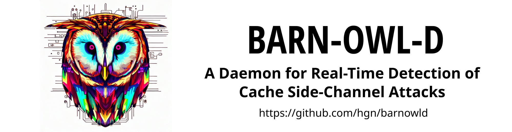
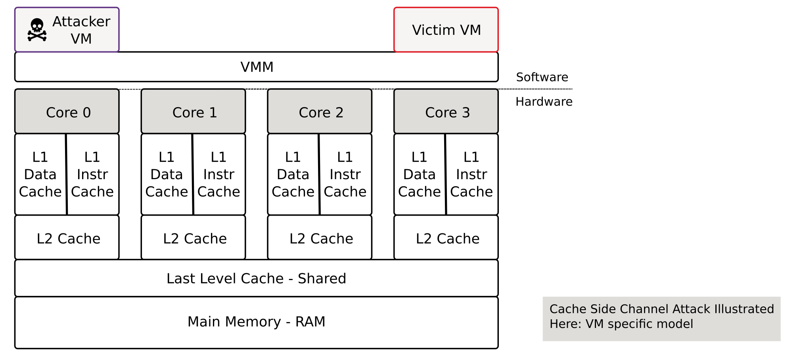
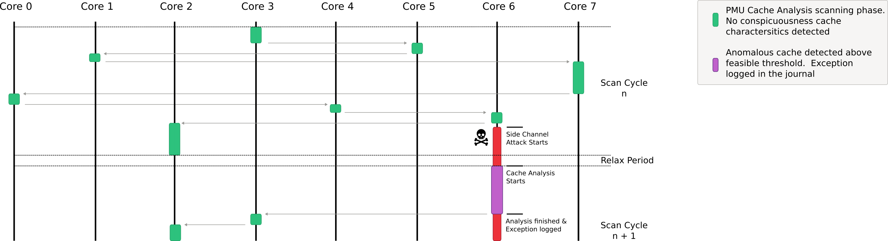

<p align="center">
  <br>
</p>


*The project name is inspired by a barn owl, which has one of the best hearing in the
animal world. Just the right 	organ of perception to detect the smallest but
unnatural frequent failed accesses to CPU cache lines. Alternatively the name
is selected because the name can easily be turned into a cute logo via DALL-E 2
and the project name was still available. You can choose the reason yourself.*

> **Disclaimer:** barnowld is a PoC - I have tested it with many different
> cache side-channel PoCs, and carefully tuned thresholds, but in the end it
> needs more validation to be used productively! Some classes of side-channel
> attacks like *flush + flush attacks* or utilizing the branch target buffer
> are not detected - due to the fact that only cache characteristics are
> analysed (but I have a few ideas to detect them as well, but this goes along
> with the use of vendor specific PMU events).

<p align="center">
  <br>
</p>

---

**Idea of the daemon: try to detect conspicuous CPU characteristics with as little
computational effort as possible, which can be traced back to side-channel
attacks with a very high probability.** If these are detected, report the event
to the system log. Log monitoring systems for cloud systems, for example,
can trigger a warning when these messages are detected (i.e. possible attacks
are logged with severity of `error` into the log, so filter for error).

Related work: some scientific publications are available on the Internet to
detect side channel attacks. The "problem" with these publications is that they
often involve machine learning and other compute intensive hardware
requirements or are complex to operate (in terms of CPU resources). In
addition, the source code is usually not available, why I decided to implement
this independently in this particular form. But I am always grateful for
references. See section *Related Work* for more information.

> **Warning:** Barnowl is not a countermeasure that effectively protects
> against side channel attacks! Safe protection is to install and activate all
> countermeasures like vendor provided firmware upgrades or kernel security
> measures. Barnowld only detects side channel attacks - but that also for side
> channel attacks that are not known to date! Barnowl can be used as additional
> protection with very low overhead. In addition, Barnowl can of course be used
> where a firmware upgrade or kernel protection cannot be used due to
> performance degradation or because the system is located in "safe
> environments".

<p align="center">
  <br>
</p>

# Usage and Example

Installation and Execution

```
git clone https://github.com/hgn/barnowld.git && cd barnowld
cargo build
$(pwd)/target/debug/barnowld -v
# or in daemon mode with journal connection
sudo systemd-run --system --wait $(pwd)/target/debug/barnowld
```

Detected Cache Side-Channel Attacks are printed to STDOUT or into systemd's
journal if running as daemon. See the example output for a spectre detection
which is logged with log level error into systems journal.

```
Possible cache side-channel attack on CPU 0 detected!
Cache miss/ref ratio 96.43% above trigger threshold of 90.00%
Within 6 recorded seconds on CPU 0, 42230182 cache references where detected and 40724557 cache misses
To further invesigative this alert please install perf and execute to following
commands to narrow down the specific origin process.
  perf record -e cache-references,cache-misses -C 0
  perf report --stdio
```

If further analyse is performed like suggested, the output may look like the following capture.

```
$ sudo perf record -e cache-references,cache-misses -C 0
[ perf record: Woken up 20 times to write data ]
[ perf record: Captured and wrote 6,340 MB perf.data (93086 samples) ]

$ sudo perf report --stdio
# Overhead  Command          Shared Object      Symbol
# ........  ...............  .................  ...........................................
    97.96%  spectre.out      spectre.out        [.] readMemoryByte
     1.67%  spectre.out      spectre.out        [.] victim_function
     0.04%  spectre.out      [kernel.kallsyms]  [k] _raw_spin_lock_irqsave
     0.03%  spectre.out      [kernel.kallsyms]  [k] __i915_vma_retire
     0.01%  kworker/0:2-eve  [kernel.kallsyms]  [k] collect_percpu_times
```

Here a process with name spectre.out triggers the massive cache miss ratio. The
exact PID can be further investigative with `perf script` for example.

To install Barnowld as a permanent systemd service just a few commands are
required, these will build Barnowld as a release executable (via `cargo
release`) and install all required files. Subsequent commands will start/enable
the service:

```
# build as barnowld as release and install into system directories
$ make install

# trigger service file reload für systemd 
$ sudo systemctl daemon-reload

# start the service
$ sudo systemctl start barnowld.service

# check if everything works well
$ sudo systemctl status barnowld.service
$ sudo journalctl -u barnowld.service -f

# enable permanently as you like
$ sudo systemctl enable barnowld.service
```

# Implementation Aspects

Barnowld analyzes all available logical CPUs (hardware threads, called Harts in
the RISC-V world) for abnormalities over a certain period of time. In doing so,
it iterates over time and in a pseudo-random fashion over the CPUs to make
countermeasures more difficult. Then Barnowl analyzes the cache reference and
cache missrate for a certain amount of time - again pseudo-randomly. Here
especially the last level cache characteristics. Basically the following Cache
Side-Channel attacks should be detectable:

- Flush+Reload
- Evict+Time
- Cross-VM Cache Attacks
- Prime+Probe (not successful, at least for PoC https://github.com/Miro-H/CacheSC)

As noted earlier, flush+flush or Branch History Attacks are not detectable by
this method.

For this purpose Barnwold uses the so-called Counting Mode of the Performance
Monitor Unit (PMU) of the processor. In contrast to the Sampling Mode, the
Counting Mode has defacto no measurable overhead. Also PMUs are available for
all major platforms from Intel, AMD, ARM or RISC-V.

The downside of counting mode is that no sampling take place and thus no
specific process can be identified. The massive disadvantage of the sampling
mode would be that the CPU, kernel and user space would be much more noticeably
burdened. But: if you consider this in relation to the fact that you are
99.999% not affected by any cache side channel attack, this is a good
consideration.

I tried to trigger **false positives** via different use cases. E.g. `dd
if=/dev/random ...` or other hand-crafted random copy loops in c-lang.
Currently I haven't come across any application which leads to false positive.
But I am also grateful for valuable inputs and issues. On the other hand: if a
legitimate application really shows such a bad (high) cache miss rate over a
longer period of time, then the application should be looked at - something
could be fixed here anyway. Self-modifying code may be a source of high cache
misses, but the periods should be limited to some milli-seconds, but also the
ratio for self modifying code should be less then 50%.

The implementation is based on the perf subsystem of the Linux kernel which is
designed around two aspects: flexibility and performance. In fact, perf can be
seen as a command system call, which efficiently exchanges data between kernel
space and user space using a ring buffer. So ideal conditions if these analyses
are to be made with the goal of lowest overhead.

# PoC Test Disclaimer

Some of the tests may not work out of the box at your PC. Some PoCs can only be
executed if Meltdown/Spectre Linux Kernel counter measures are disabled.

If you use updated microcode to fix speculative execution side-channel attacks
some of the provided PoCs may also not work at your local PC.


# Related Work

- "SPECULARIZER: Detecting Speculative Execution Attacks via Performance Tracing",
  https://yinqian.org/papers/dimva21.pdf
- "WHISPER A Tool for Run-time Detection of Side-Channel Attacks",
  https://www.researchgate.net/publication/340697201_WHISPER_A_Tool_for_Run-time_Detection_of_Side-Channel_Attacks
- "Real-Time Detection for Cache Side Channel Attack using Performance Counter Monitor",
  https://www.mdpi.com/2076-3417/10/3/984
- "NIGHTs-WATCH: A Cache-based Side-channel Intrusion Detector Using Hardware Performance Counters",
  https://hal.science/hal-01806729/document

# Development


For journal testing the following commands can be used:


```
# to start barnowld in systemd context without service file
sudo systemd-run --system --wait $(pwd)/target/debug/barnowld
# CTRL-C to interrupt 

# view the journal
sudo journalctl -n 50 -e
```
